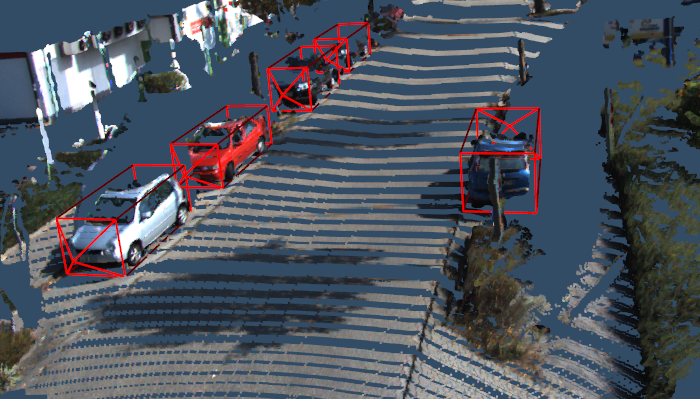

# 3D Scene Visualizer
3D scene visualization demos for development, using [VTK](https://vtk.org/). Note that some of these scripts are experimental.

---
Demos included for:
- KITTI
- nuScenes
- Argoverse
---
Depth completion ([IP-Basic](https://github.com/kujason/ip_basic)) example on KITTI with labels shown:


If you find this code useful, please consider citing:

- VMVS (IROS 2019): [Improving 3D Object Detection for Pedestrians with Virtual Multi-View Synthesis Orientation Estimation](https://arxiv.org/abs/1907.06777) 
- IP-Basic (CRV 2018): [In Defense of Classical Image Processing: Fast Depth Completion on the CPU](https://arxiv.org/abs/1802.00036) 

Other works that also use this visualization:
- [AVOD](https://arxiv.org/abs/1712.02294)
- [MonoPSR](https://arxiv.org/abs/1904.01690)

---

## Environment
Python 3.5.2 or 3.6

```bash
workon [virtualenvname]
pip install -r requirements.txt
add2virtualenv src
```

Or in PyCharm:
- Right-click `src` -> Mark Directory As -> Sources Root 

---

### KITTI Setup
Download files and place them in `~/Kitti`:
```
/home/$USER/Kitti
    object
    odometry
    raw
```

#### Optional Scripts 
- Run [depth completion](https://github.com/kujason/ip_basic)
    - `scripts/depth_completion/save_depth_maps_obj.py`
    - `scripts/depth_completion/save_depth_maps_raw.py`
- Save the outputs into their corresponding Kitti folders. Ex.
    - obj: `~/Kitti/object/training/depth_2_multiscale`
    - raw: `~/Kitti/raw/2011_09_26/2011_09_26_drive_0039_sync/depth_02_multiscale`
    
#### Demos
- `kitti_obj/view_sample_3d.py` - view point cloud and boxes
- `kitti_odometry/overlay_odom_point_clouds_orbslam.py`
- `kitti_raw/overlay_xxx.py` - overlay point clouds from multiple frames
- `kitti_raw/depth_completed_point_clouds.py` - shows depth completed point clouds from IP-Basic
    
---

### nuScenes Setup
(Work in Progress)
- Add a symlink to the nuscenes data in `data/dataset/nuscenes`

#### Demos
- `show_top_lidar.py`: Show top LiDAR point cloud

---

### Argoverse Setup
- Add a symlink to the argoverse data in `data/dataset/nuscenes`
- Install the argoverse api from [https://github.com/argoai/argoverse-api](https://github.com/argoai/argoverse-api)

#### Demos
- `pointcloud_example.py`: Show point cloud

---


## Controls:
- Drag: Rotate around focal point
- Scroll / Right click + drag: Zoom
- Middle click + drag / Shift + drag: Move camera
- Ctrl + drag: Rotate around camera axis

Keys:
- a: Toggle axes visibility
- t: Set camera to (0, 0, 0)
- r: Reset camera
- f: Set focal point to actor/point under mouse
- F1-F12: Toggle actor visibility
- 3: Red/Green 3D?
- s: Render as solids
- w: Render as wireframes
